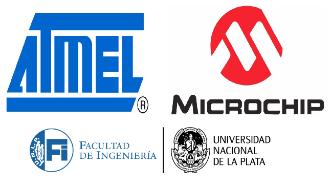

# Información
 
El repositorio se trata de 3 proyectos de sistemas embebidos realizados a lo largo de la materia "Circuitos Digitales y Microcontroladores". El objetivo de dicha materia es iniciar al alumno en el estudio, diseño e implementación de sistemas embebidos con microcontroladores, orientados a la solución de problemas en tiempo real.

## Herramientas y materiales utilizados
Todos los proyectos fueron desarrollados para el microcontrolador **ATMEGA328P**, por lo que se utilizo la placa de desarrollo Arduino Uno. Para crear los códigos se utilizo el entorno de desarrollo **Atmel Studio 7** junto al lenguaje **C**.

## Sobre los proyectos
Cada proyecto cuenta con el ***enunciado***, el ***código*** y un ***informe final*** donde se presenta la interpretación del problema, los razonamientos aplicados para llegar a la resolución, los periféricos utilizados y su configuración, entre otros. 

## Conocimientos adquiridos sobre Hardware:
- Microcontroladores 8bits/32Bits, Periféricos.
- La familia de Microcontroladores AVR.
- Puertos E/S, Circuitos de reloj, Temporizadores. Generadores PWM. Conversores A/D y D/A.
- Interfaces de comunicación: UART, I2C, SPI.
## Conocimientos adquiridos sobre Software:
- Programación en Lenguaje C para sistemas Embebidos.
- Modularización, Planificadores, manejador de dispositivos.
- Planificación de tareas de Tiempo real, tareas cooperativas, interrupciones.
- Modelización con Máquinas de Estado Finitos (MEF) y generalización.
- Sistemas Operativos en tiempo real para Sistemas embebidos (RTOS).